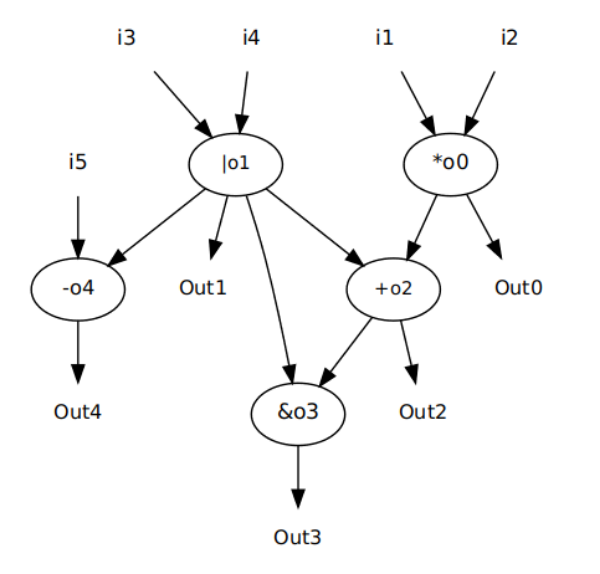
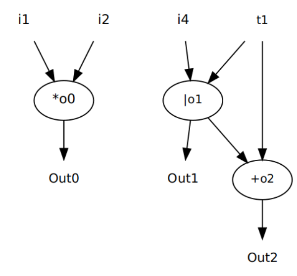
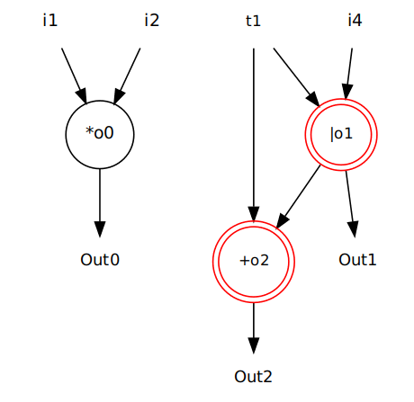

# Exact


A Free and Open Source Tool for Enumeration and Selection of Custom Instructions (CI). Using **parser** you can parse a **.cfg** file (generated by gcc compiler) and generate all basicblocks in **GraphViz** format. **exactui** tool enumerates all pathes in a DFG (basicblock) and finds all custom instruction that satisfy all constraints (e.i. # of read and write ports).

To start with parser and exactui first clone and make the repository:

```
git clone https://github.com/pourfard/UTIC
cd UTIC/src
make
```

After running make command two binary files namely **parser** and **exactui** will be compiled. Before using **parser** you should generate **.cfg** (Control Flow Graph) of your source code. This will be done by g++ compiler. For example we have a **test.cpp** file that locks like as below:

```cpp
//
//  File: test.cpp , this is just a test file
//  Project: UTIC
//  Author: Mahdi Mohammad Pour Fard
//  Supervisor: Dr. Salehi
//  Copyright (c) 2015 (University of Tehran). All rights reserved.
//


#include <stdio.h>

int main()
{
	int t1,t2,t3,t4,t5,i1,i2,i3,i4,i5;
	t1 = i1 * i2;
	t2 = i3 | i4;
	t3 = t1 + t2;
	t4 = t3 & t2;
	t5 = t2 - i5;

	if(t1 == 10)
	{
	    t3 = i1 * i2;
        t2 = t1 | i4;
        t5 = t1 + t2;

        if(t3==12)
        {
            t3 = 30 * t1;
            t2 = t1 + t5;
            t3 = i1 * i2;
            t2 = t1 | i4;
            t1 = 48 * t2;
            t2 = t5 + t4;
            t5 = t1 + t2;
            t1 = 48 * t2;
            t2 = t5 + t4;
            t4 = 36 * t2;
            t5 = t1 + t4;
        }
        else if(t3==50)
        {
            t3 = 30 * t1;
            t2 = t1 + t5;
            t3 = i1 * i2;
            t2 = t1 | i4;
            t5 = t1 + t2;
        }
        else if(t3==40)
        {
            t1 = 23 * t2;
            t2 = t5 + t4;
            t4 = 12 * t2;
            t5 = t1 + t4;
            t1 = 48 * t2;
            t2 = t5 + t4;
        }

        for(int i=0;i<40;i++)
        {
            t1 = i1 * i2;
            t2 = i3 | i4;
            t3 = t1 + t2;
            t4 = t3 & t2;
        }

	}
	else
	{
	    t3 = 30 * t1;
        t2 = t1 + t5;
        t1 = 48 * t2;
        t2 = t5 + t4;
        t4 = 36 * t2;
        t5 = t1 + t4;

        for(int i=0;i<40;i++)
        {
            t2 = i3 | i4;
            t3 = t1 + t2;
            t1 = 48 * t2;
            t2 = t5 + t4;
            t4 = t3 & t2;
            t5 = t2 - i5;
        }
	}

	return 0;
}
```

Now we run g++ with "-fdump-tree-cfg" option to generate **.cfg** file.

```
sudo g++ -std=c++0x test.cpp -fdump-tree-cfg -o output
```

The generated file neme ends with ".cfg". In my case its name is "test.cpp.011t.cfg". Now we will use **parser** to findout all basicblocks of **.cfg** file and then extract all custom instructions from those basicblocks. 

```
sudo ./parser *.cfg
```

After running this command two directories will be created. One is BasicBlocks, containing all basicblocks of the .cfg file. In our case ten basicblocks are generated. Some of them are as below:




Outputs directory contais all **custom instructions** for each basicblock considering hardware and software constraints. For example for basicblock **bb1.gv** one custom instruction is find in a directory with "2R_2W". This means this custom instruction has two inputs and two outputs and its visualization is like below:


All generated file have .gv or .dot extentions and can be viewed by xdot tool. You can install this tool in ubuntu using this command:

```
sudo apt-get install xdot
```

In Windows operating systems you can use GraphViz to see .gv and .dot files.


If you want to identify a different basicblock for custom instruction you can use the following command. **bit.conf** is the configuration file.

```
sudo ./exactui thebasicblock.gv bit.conf
```

This tool is the source code of this paper: http://ieeexplore.ieee.org/document/8310727/
